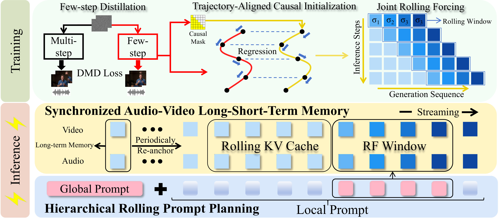
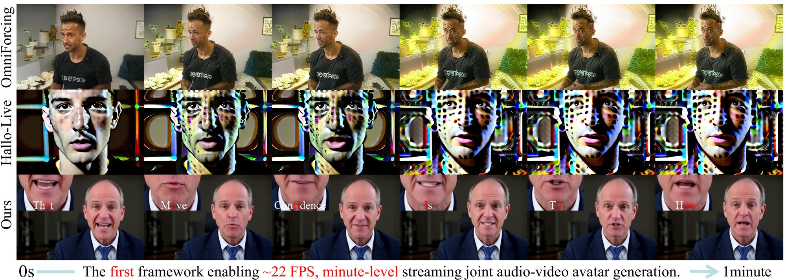
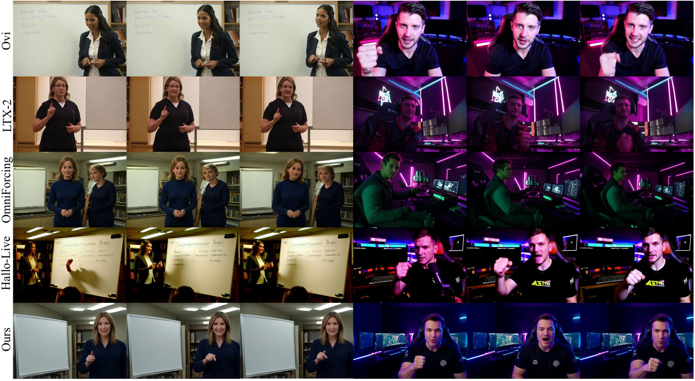

# Omni-LiveAvatar: Minute-Level Real-Time Streaming Joint Audio-Visual Avatar Generation

Lunjie Zhu<sup>1,2</sup>, Xingtong Ge<sup>1,2</sup>, Fangyu Lin<sup>1,2</sup>, Yi Zhang<sup>2</sup>, Zhening Liu<sup>1</sup>, Mengfei Li<sup>1,2</sup>, Yumeng Zhang<sup>1</sup>, Guanglu Song<sup>2</sup>, Yu Liu<sup>2</sup>, Jun Zhang<sup>1</sup>

<sup>1</sup> Hong Kong University of Science and Technology
<sup>2</sup> Vivix Group Limited

[](https://arxiv.org/abs/2608.13602)
[](https://arxiv.org/pdf/2608.13602)
[](https://aoko955.github.io/Omni-LiveAvatar/)

## Abstract

Joint audio-video generative models serve as the foundation for immersive and interactive digital-human generation. Nevertheless, most existing models rely on bidirectional attention and multi-step denoising and can generate only short clips, making them unsuitable for real-time interaction over extended durations. We present **Omni-LiveAvatar**, the first framework for minute-level, real-time streaming joint audio-video avatar generation. Specifically, we propose (1) a *progressive autoregressive distillation pipeline* that transfers a large bidirectional joint audio-video diffusion model into a few-step autoregressive generator without auxiliary stabilization mechanisms; (2) a *synchronized audio-video long-short-term memory* that preserves global consistency under a bounded memory budget; and (3) a *hierarchical rolling prompt planning* strategy that enables coherent semantic evolution and seamless prompt transitions. Extensive experiments show that Omni-LiveAvatar generates high-quality, synchronized minute-level avatars in real time. In terms of speed, it achieves a **33×** generation speedup over its teacher, LTX-2, on a single NVIDIA H200 GPU; in terms of generation quality, it outperforms accelerated baselines across visual quality, audio quality, cross-modal synchronization, and human fidelity.

## Method Overview

Omni-LiveAvatar converts a bidirectional joint audio-video diffusion teacher into a real-time streaming generator through three components:

- **Progressive Autoregressive Distillation**: Few-Step Distillation → Trajectory-Aligned Causal Initialization → Joint Rolling Forcing, without auxiliary stabilization mechanisms.
- **Synchronized Audio-Video Long-Short-Term Memory**: periodically re-anchored long-term memory plus a rolling KV cache, preserving global consistency under a bounded memory budget.
- **Hierarchical Rolling Prompt Planning**: a fixed global prompt with block-level local prompts that advance with the rolling window for smooth long-form semantic evolution.



*Figure: Overview of Omni-LiveAvatar. Top: progressive autoregressive distillation. Middle: synchronized audio-video long-short-term memory for minute-level streaming. Bottom: hierarchical rolling prompt planning.*

## Selected Results

On a single NVIDIA H200 GPU, Omni-LiveAvatar reaches **21.99 FPS** with a **33×** speedup over LTX-2, and is best across the evaluated metrics on both 5-second and 60-second generation.

### 5-Second Avatar Generation

Best results among real-time autoregressive models are in **bold**. ↑ indicates higher is better.

| Method | FPS↑ | Quality Score↑ | VideoAlign↑ | Human Identity↑ | UTMOS↑ | SyncNet↑ |
| --- | ---: | ---: | ---: | ---: | ---: | ---: |
| LTX-2 | 0.60 | 79.39 | 7.77 | 92.93 | 3.54 | 6.89 |
| Ovi | 1.41 | 76.14 | 6.51 | 97.13 | 3.10 | 6.88 |
| OmniForcing | 16.11 | 80.05 | 8.11 | 98.51 | 2.46 | 1.60 |
| Hallo-Live | 16.50 | 74.21 | 8.04 | 97.42 | 2.96 | 4.50 |
| **Omni-LiveAvatar** | **19.57** | **81.72** | **9.08** | **100.00** | **3.19** | **6.16** |

### Minute-Level (60s) Avatar Generation

| Method | FPS↑ | Aesthetic↑ | VideoAlign↑ | Human Identity↑ | UTMOS↑ | SyncNet↑ |
| --- | ---: | ---: | ---: | ---: | ---: | ---: |
| OmniForcing | 16.18 | 54.90 | 6.68 | 50.19 | 1.60 | 0.28 |
| Hallo-Live | 13.80 | 47.16 | 5.46 | 67.60 | 2.02 | 0.72 |
| **Omni-LiveAvatar** | **21.99** | **61.98** | **9.82** | **98.61** | **2.80** | **6.76** |

Full tables are available in the [paper](https://arxiv.org/abs/2608.13602) and on the [project page](https://aoko955.github.io/Omni-LiveAvatar/).

## Qualitative Results

Compared with OmniForcing and Hallo-Live, Omni-LiveAvatar keeps a consistent avatar and background over a minute-long rollout, with tighter audio-video alignment.



*Figure: Qualitative comparison of minute-level generation. Omni-LiveAvatar preserves appearance consistency and lip-audio alignment, while baselines exhibit severe appearance drift.*



*Figure: Qualitative comparison of 5-second avatar generation. Omni-LiveAvatar produces realistic, temporally consistent avatars, whereas OmniForcing shows realism degradation and Hallo-Live suffers from facial/hand artifacts and color drift.*

## TODO

Code and checkpoints are not released yet. We will update this repository as they become available.

- [ ] Release inference code
- [ ] Release pretrained checkpoints
- [ ] Release training code

## Citation

If you find this work useful, please cite:

```bibtex
@misc{zhu2026omniliveavatar,
  title={Omni-LiveAvatar: Minute-Level Real-Time Streaming Joint Audio-Visual Avatar Generation},
  author={Lunjie Zhu and Xingtong Ge and Fangyu Lin and Yi Zhang and Zhening Liu and Mengfei Li and Yumeng Zhang and Guanglu Song and Yu Liu and Jun Zhang},
  year={2026},
  eprint={2608.13602},
  archivePrefix={arXiv},
  primaryClass={cs.MM},
  url={https://arxiv.org/abs/2608.13602}
}
```
